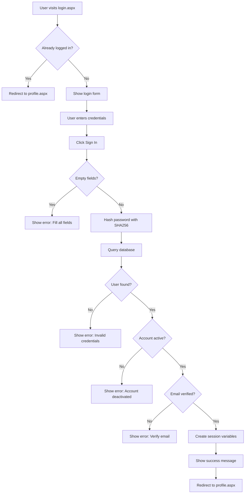

# Login & Profile Implementation Summary

## ✅ Completed Tasks

### 1. **Profile UI** (Already Implemented)
The profile page (`profile.aspx`) features a complete, modern UI with:
- Avatar circle with user initials
- User's full name and email display
- Role badge (Member/Admin) with color coding
- Profile sections:
  - **Basic Information**: Department, Year/Level, Primary Interest, Member Since
  - **About Me**: Bio section
- Action buttons:
  - Home button
  - Admin panel button (visible only for admins)
  - Logout button

**Features:**
- Responsive design (mobile-friendly)
- Modern glassmorphism styling
- Gradient backgrounds
- Automatic redirect if not logged in
- Session-based authentication

### 2. **Login Code** (Now Implemented)
The login functionality (`login.aspx.cs`) includes:

#### Security Features:
- ✅ Password hashing using SHA256
- ✅ SQL injection prevention with parameterized queries
- ✅ Account status validation (active/inactive)
- ✅ Email verification check
- ✅ Session management

#### Validation:
- ✅ Empty field validation
- ✅ Invalid credentials handling
- ✅ Deactivated account detection
- ✅ Unverified email detection

#### User Experience:
- ✅ Clear error messages
- ✅ Success message with auto-redirect
- ✅ Prevents already-logged-in users from accessing login page
- ✅ Redirects to profile after successful login

#### Session Variables Set:
- `UserID` - User's unique identifier
- `Username` - Generated from email
- `FirstName` - User's first name
- `LastName` - User's last name
- `Email` - User's email address
- `Role` - User's role (Member/Admin)
- `IsAdmin` - Boolean flag for admin users

## 🔐 Authentication Flow

## 📁 Files Modified

1. **`login.aspx`**
   - Added `OnClick="btnSignIn_Click"` to the Sign In button

2. **`login.aspx.cs`**
   - Complete login logic implementation
   - Session management
   - Security validations
   - Error handling

3. **`profile.aspx.cs`** (Already existed)
   - Displays user profile information
   - Handles logout functionality
   - Loads data from database using session UserID

## 🧪 Testing the Implementation

### Test Login Flow:
1. Navigate to `login.aspx`
2. Enter a registered email and password
3. Click "Sign in"
4. Should redirect to `profile.aspx` showing user details

### Test Cases:
- ✅ Valid credentials → Success
- ✅ Invalid email → Error message
- ✅ Wrong password → Error message
- ✅ Empty fields → Validation error
- ✅ Inactive account → Deactivation message
- ✅ Already logged in → Auto-redirect to profile
- ✅ Not logged in on profile → Redirect to login

### Database Requirements:
Ensure the `Users` table has these columns:
- `UserID` (INT, Primary Key)
- `Username` (VARCHAR)
- `Email` (VARCHAR)
- `PasswordHash` (VARCHAR - SHA256 hash)
- `FirstName` (VARCHAR)
- `LastName` (VARCHAR)
- `Department` (VARCHAR)
- `YearOfStudy` (VARCHAR/INT)
- `Bio` (TEXT)
- `Skills` (VARCHAR)
- `Role` (VARCHAR - "Member" or "Admin")
- `IsActive` (BOOLEAN/TINYINT)
- `IsEmailVerified` (BOOLEAN/TINYINT)
- `JoinDate` (DATETIME)

## 🎨 UI Styling

The login and profile pages use the shared `auth.css` stylesheet featuring:
- Modern dark theme with gradients
- Glassmorphism effects
- Responsive grid layout
- Smooth animations and transitions
- Color-coded status messages (success/error)
- Professional typography (Inter & Outfit fonts)

## 🔗 Related Pages

- **`register.aspx`** - User registration (already implemented)
- **`logout.aspx`** - Session clearing and logout
- **`Default.aspx`** - Home page
- **`members.aspx`** - Members list
- **`all-projects.aspx`** - Projects list

## 🚀 Next Steps (Optional)

1. **Remember Me functionality** - Add persistent login with cookies
2. **Forgot Password** - Implement password reset flow
3. **Two-Factor Authentication** - Add extra security layer
4. **Login History** - Track user login activity
5. **Rate Limiting** - Prevent brute force attacks
6. **CAPTCHA** - Add bot protection after failed attempts

## 📝 Notes

- Passwords are hashed using SHA256 (consider upgrading to bcrypt for production)
- Email verification is enforced in login
- Database connection string is in `DatabaseHelper.cs`
- All database queries use parameterized queries to prevent SQL injection
- Sessions expire based on Web.config timeout settings
